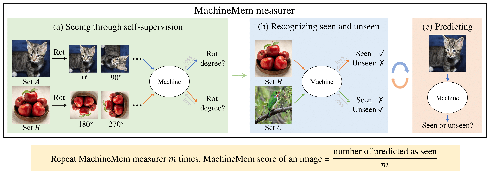

# MachineMem

### [Project page](https://junlinhan.github.io/projects/machinemem.html), [arXiv](https://junlinhan.github.io/projects/machinemem.html)
This is the official PyTorch implementation of "What Images are More Memorable to Machines?" This repo currently supports the training and testing of the MachineMem predictor. Instructions for GANalyze are also provided. Codes for running the MachineMem measurer will be released before March 2023.

[What Images are More Memorable to Machines?](https://arxiv.org/abs/2201.12078) <br>
[Junlin Han](https://junlinhan.github.io/), [Huangying Zhan](https://huangying-zhan.github.io/), Jie Hong, Pengfei Fang, [Hongdong Li](http://users.cecs.anu.edu.au/~hongdong/), [Lars Petersson](https://people.csiro.au/P/L/Lars-Petersson), [Ian Reid](https://cs.adelaide.edu.au/~ianr/) <br>
University of Adelaide and Data61-CSIRO and Australian National University <br>



### Getting started

- Clone this repo:
```bash
git clone https://github.com/JunlinHan/MachineMem.git
```

- Install PyTorch 1.7 or above and other dependencies (e.g., torchvision, timm, numpy, scipy, pillow, scikit-learn).

- You may build a new conda environment by running `conda env create -f environment.yml`.
### How to run the code?

For predictor, please see [./predictor](predictor).

For GANalyze, please see [./GANalyze_instructions](GANalyze_instructions).

## Contact
junlin.han@data61.csiro.au or junlinhcv@gmail.com

## Cite
If you use our code or our results/findings, please cite our paper. Thanks!
```
@inproceedings{han2022machinemem,
  title={What Images are More Memorable to Machines?},
  author={Junlin Han and Huangying Zhan and Jie Hong and Pengfei Fang and Hongdong Li and Lars Petersson and Ian Reid},
  booktitle={arXiv preprint arXiv:},
  year={2022}
}
```

## Acknowledgments
Our code is developed based on [official PyTorch ImageNet training code](https://github.com/pytorch/examples/tree/master/imagenet).
